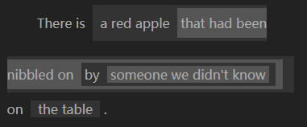

# GHAR

> In English ↓

----

GHAR, Graphical Hierarchy Aided Representation

It is a graphical representation that aids one using hierarchical logic in understanding complex sentence components while reading.

## What does GHAR look like

Here I use a sentence from [Microsoft WPF .NET 6.0 documentation](https://docs.microsoft.com/zh-cn/dotnet/desktop/wpf/overview/?view=netdesktop-6.0) to show how GHAR actually works.

The original sentence is:

* The user experiences that are delivered by the application model are constructed controls.

When use GHAR, it looks like:

## Why GHAR

I am not a native English speaker and the first time I came up with the idea about GHAR is also target to my native language, Chinese.

As you know, there are lots of docs written in English, and I have to read them in my daily life, sometime I use the machine translator like the extension with Google Chrome or DeepL to aid my progress, even I sometimes translate some docs by myself.

I regularly read some translated version of famous books published in Chinese too, just like the result of the machine translator, If you follow the original text strictly (instead of narrating entirely in your own way of thinking), you will often encounter sentences with extremely complex components or with ambiguities due to differences in language conventions.

Just like the juxtaposition I wrote about in the content above:

* the machine translator like the extension with Google Chrome or DeepL

What I am trying to say subjectively is `machine translator` like `the extension with Google Chrome` or like `DeepL`.

Just like the misunderstanding made by the machine translator showed by the graph above, if you are unfortunately not familiar with this field, you may spend time thinking about what are the targets of the word `'or'`, and may get a result of misunderstanding —— the extension with `Google Chrome` or the extension with `DeepL`.

This can certainly be avoided by strict wording, but there are many non-native English speakers there, like me, from all over the world, who are not well versed in English grammar and even can't aware of the possible ambiguities.

So...

For reasons like these, I decided that, at least, for me, I would use GHAR in my own writing in such a way as to avoid ambiguity, as well as to reduce the amount of thinking that goes into reading that is not related to the content, but only to the grammar, and to improve reading efficiency.

## GHAR Rules

GHAR uses nesting of 2 shades of background color which are different from the main background color of text, to identify the `complex sentence components`.

To avoid to make things annoyed, GHAR only represent hierarchy with branchless nesting.

Most `complex sentence components` are noun lexical.

Example:

## Implementation

There is NO complete implementation of GHAR so far.

In my own project, I use `a JS Parser with CSS` to render HTML's span elements added manually by key shortcuts to declare the hierarchy.

----

> 中文部分 ↓

----

GHAR 是 Graphical Hierarchy Aided Representation 的缩写，中文为 `图形化 层次 辅助表达`

是一种 在阅读时，用 层次逻辑 来辅助人们理解 复杂句子成分 的 图形化表示法。

## GHAR 长啥样儿？

这里我用一个 翻译自 [微软 WPF .NET 6.0 文档](https://docs.microsoft.com/zh-cn/dotnet/desktop/wpf/overview/?view=netdesktop-6.0) 的句子 做栗子：

原句：

* 由应用模型提供的用户体验是经过构建的控件。

用 GHAR 来表示的话，是这样：

注：因为仅展示 GHAR 的效果，所以图中的句子没添加原文翻译标注。

## 为啥用 GHAR？

最开始有这样的想法是因为，很多文档都是用英语写的，我有时候也会翻译文档，这种时候我就经常偷个小懒，借助 Google Chrome 带的扩展或者DeepL这些机器翻译来帮忙。

我也经常会读一些出版成中译版的著名外文书，但是和机翻的结果类似地，如果严格遵循原文进行翻译，而不是自己组织语言表述的话，那么由于语言习惯的差异，就经常会遇到极端复杂的句子成分或者存在歧义的句子。

就比如上边写到的一个句子中的并列关系：

* the machine translator like the extension with Google Chrome or DeepL

这句话的原文，我主观想表达的是：像 `Google Chrome带的扩展` 或者 `DeepL` 这样的 `机器翻译`。

就像上图里的机翻结果那样，如果很不幸地你对语境的领域并不熟悉，那你很可能需要花点时间琢磨一下介词 `'or'` 究竟表达的是谁和谁之间的关系，也可能会产生和机翻结果一样的误读，也就是——`or`修饰的是 `Google Chrome` 和 `DeepL`，原句的意思就被曲解成了 `Google Chrome 带的扩展或者DeepL带的扩展这样的机器翻译`。

除了翻译这块，中文领域的话，再再比如，还是我上边写到的一句话：

* 上边写到的一个句子中的并列关系

又会是下边哪种呢？

* 上边写到的 `一个句子中的并列关系`
* `上边写到的一个句子` 中的并列关系

这些问题肯定是可以通过严格措辞来避免的，但是并不是每个人都能精通某种语言的语法，而且有时候可能意识不到自己写出的内容存在歧义。

所以…

因为这些原因，我决定，至少，对于我来说，我会在自己的写作中使用 GHAR 来避免歧义，同时减少在阅读时仅和语法有关但和内容无关的思考量，来提高阅读效率。

## GHAR 规则

GHAR 用 和文字主背景色不同的2种深浅背景色的嵌套 来标识 `复杂句子成分`。

为了保持优雅，避免一切变得过于复杂，GHAR 仅用无分支的嵌套来表示层次。

大部分 `复杂句子成分` 是名词词性的。

再来一个栗子：

## 实现

目前，还没有完全的 GHAR 实现。

我自己的项目中，用了 JS 解析器和 CSS 来渲染 通过快捷键手动添加的、用于声明层次结构的 HTML 的 span元素。
